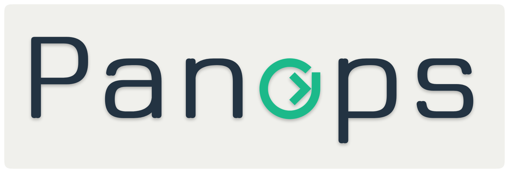

  

  
  

Open-source local-first macOS recorder with screenshot-anchored meeting notes. Captures audio (mic + system + per-app), screen, and time-anchored screenshots; transcribes live and refines with a higher-quality post-pass; emits markdown notes with embedded screenshots via a BYO local-or-cloud LLM.

The wedge no other OSS tool occupies: **screen + audio + screenshot-anchored notes, fully local, BYO-everything, no account required**.

## Architecture

Hexagonal Rust core engine + SwiftUI macOS shell + Swift sidecars (WhisperKit + FluidAudio for ASR, Apple FoundationModels for the on-device LLM). Every platform-specific concern is a port (trait) with a `mac-native` adapter and a `portable` fallback. Drop the Mac code and the engine compiles for Linux/Windows.

## Status

Pre-alpha. Slice 01 (skeleton) lands the Cargo workspace and test fixtures. See `docs/superpowers/plans/` for the active slice and `docs/superpowers/specs/` for the design.

## License

MIT.
