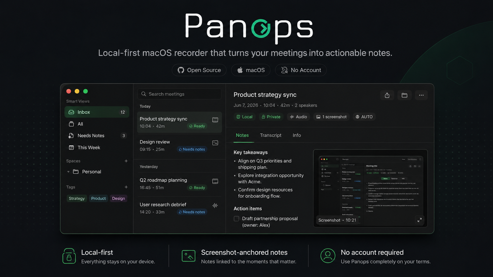

  

  
  
  
  

Panops is an open-source, local-first macOS recorder with screenshot-anchored meeting notes. It captures audio (mic + system + per-app), the screen, and time-anchored screenshots; transcribes with a multilingual VAD pass and refines with a higher-quality post-pass; and emits markdown notes with embedded screenshots via a BYO local-or-cloud LLM.

The wedge no other OSS tool occupies: **screen + audio + screenshot-anchored notes, fully local, BYO-everything, no account required.**

## Why Panops

- **Local-first.** Capture, transcription, and notes all run on your device. Zero telemetry, ever.
- **Screenshot-anchored notes.** Notes link back to the moments that mattered, so a takeaway jumps you to what was on screen.
- **No account required.** No sign-up, no cloud, no plan. Your meetings live in plain files on your Mac.
- **BYO models.** On-device Apple FoundationModels + WhisperKit, or point it at your own local/cloud LLM.

## Architecture

Hexagonal Rust core engine + SwiftUI macOS shell + Swift sidecars (WhisperKit + FluidAudio for ASR, Apple FoundationModels for the on-device LLM). Every platform-specific concern is a port (trait) with a `mac-native` adapter and a `portable` fallback. Drop the Mac code and the engine compiles for Linux/Windows.

## Status

Pre-v0.1, in active development. Working today: the headless engine (capture → diarized, multilingual transcript → screenshot-anchored markdown notes) and the SwiftUI app (live recording with a source picker + preview, meeting organization via Spaces/Projects/Tags, and rendered notes/transcript). Packaging, signing, and v0.1 polish are in progress.

## Running it

The Mac app is a SwiftPM executable that spawns the engine over a Unix socket. For a quick UI look use `scripts/dev.sh`; for the full record → transcribe → notes flow with permissions, build the signed bundle with `scripts/package.sh` and open `dist/Panops.app`. See [docs/dev-run.md](docs/dev-run.md) for details.

## Logging

`panops-engine` writes structured logs to stderr via `tracing`. Default level is `info` (model downloads, "wrote notes"); set `RUST_LOG` to override, e.g. `RUST_LOG=debug` for more detail or `RUST_LOG=off` to silence. Stdout in default mode is reserved for the JSON transcript and stays clean regardless of `RUST_LOG`.

## Name

From Argus Panoptes, the hundred-eyed giant in Greek myth. *Pan* (all) + *ops* (seeing). Fits the wedge: panops watches the screen, captures system audio, and stitches the recording into screenshot-anchored notes you can navigate later. The chevron inside the `o` of the wordmark is the visual cue.

## License

MIT, see [LICENSE](LICENSE).
